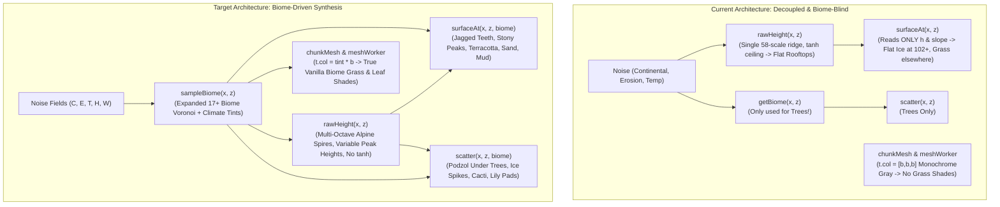

# Biome-Driven Terrain Architecture & Generator Improvement Plan

**Target Document:** [`docs/BIOME_TERRAIN_IMPROVEMENT_PLAN.md`](https://github.com/martintimmer/hollow-web-mc/blob/main/docs/BIOME_TERRAIN_IMPROVEMENT_PLAN.md)  
**Author:** Antigravity Engineering  
**Status:** Architecture Blueprint & Implementation Roadmap  
**Companion Documents:**
- [`docs/ALL_BIOMES_ELEVATION_PLAN.md`](https://github.com/martintimmer/hollow-web-mc/blob/main/docs/ALL_BIOMES_ELEVATION_PLAN.md)
- [`catalog/biome-registry.json`](https://github.com/martintimmer/hollow-web-mc/blob/main/catalog/biome-registry.json)
- [`kb/terrain/biomes.md`](https://github.com/martintimmer/hollow-web-mc/blob/main/kb/terrain/biomes.md)
- Knowledge Base Biomes: [`kb/terrain/plains.md`](https://github.com/martintimmer/hollow-web-mc/blob/main/kb/terrain/plains.md), [`kb/terrain/desert.md`](https://github.com/martintimmer/hollow-web-mc/blob/main/kb/terrain/desert.md), [`kb/terrain/swamp.md`](https://github.com/martintimmer/hollow-web-mc/blob/main/kb/terrain/swamp.md), [`kb/terrain/badlands.md`](https://github.com/martintimmer/hollow-web-mc/blob/main/kb/terrain/badlands.md), [`kb/terrain/ice-spikes.md`](https://github.com/martintimmer/hollow-web-mc/blob/main/kb/terrain/ice-spikes.md), [`kb/terrain/beach.md`](https://github.com/martintimmer/hollow-web-mc/blob/main/kb/terrain/beach.md)

---

## 1. Executive Summary & Observations

This document establishes the architecture to transform WebMC's terrain generation into a **unified, multi-layered Biome-Driven World Engine**.

### Critical User Observations & System Gaps

1. **Mountain Morphology Failure ("Flat Rooftops & Monolithic Ice Caps")**:
   - **Current Behavior**: Mountains currently render as large, broad, flat rooftops that hit an artificial ceiling plateau. There is little variation in height between peaks, and all summits above $y \ge 102$ are painted with an identical, flat ice cap (`top = 51` snow / `sub = 52` ice).
   - **Real & Vanilla Minecraft Behavior**: Mountain ranges have immense complexity:
     - Needle spires, knife-edge arêtes, and rugged horn peaks rather than flat rooftops.
     - Wide variation in peak summits (some mountains peak at $y = 85$, others at $y = 100$, and jagged spires spike to $y = 124$).
     - Variable distances and winding cols/saddles between peaks.
     - Diverse peak summit materials: **Jagged Peaks** (steep stone teeth dusted with snow and exposed ores), **Stony Peaks** (bare stone, scree, and mineral veins without snow), and **Frozen Peaks** (glaciers and packed ice crags).
2. **Grass & Foliage Color Shading Gaps**:
   - **Current Behavior**: All grass blocks, tall grass, and foliage render with monochrome vertex colors (`t.col = [b, b, b]` derived only from AO and sun shading). There is no biome-specific color tinting.
   - **Real & Vanilla Minecraft Behavior**: Vanilla Minecraft tints grass and leaves according to a 2D temperature/humidity colormap, producing distinctive regional palettes (e.g. vibrant lime in Plains, lush emerald in Jungles, murky olive in Swamps, parched yellow-brown in Savannas and Badlands, and cool mint-sage in Taigas). Furthermore, ground soil under trees varies per biome (Podzol in Redwoods/Taiga, coarse dirt in Savanna, mud in Swamps, and floral carpets in Cherry Groves).
3. **Surface Materialization Disconnect**:
   - `surfaceAt(x, z)` runs without knowing `getBiome(x, z)`. Inland desert dunes generate as green grass, badlands lack stratified terracotta bands, and swamps lack mud pools.
4. **Missing Canonical Biomes in Voronoi Space**:
   - Key biomes (**Plains**, **Desert**, **Swamp**, **Badlands**, and **Ice Spikes**) were previously missing from `BIOME_TARGETS` or aliased.

---

## 2. Deep Minecraft Wiki Investigation: How Vanilla Generates Terrain & Colors

A thorough investigation of Minecraft 1.18+ (Caves & Cliffs) specifications from the Minecraft Wiki reveals the exact mathematical formulas and architectural design of vanilla world generation:

### A. Multi-Noise Mountain & Elevation Architecture

In vanilla Minecraft 1.18+, terrain elevation is driven by four coupled noise parameters:
1. **Continentalness ($C$)**: Determines distance from ocean deeps to mountain roots.
2. **Erosion ($E$)**: High erosion produces flat plains and swamps; low erosion produces towering peaks and sheer cliffs.
3. **Peaks & Valleys ($PV$)**: Derived from folded ridge noise:
   $$PV = 1.0 - |2.0 \cdot (\text{noise} - 0.5)|$$
   Peaks generate when $PV$ peaks towards $1.0$, carving deep valleys when $PV \to 0$.
4. **Jaggedness Noise**:
   A high-frequency noise octave activated only when $PV$ is high and Erosion is low. Instead of smooth rounded hills, jaggedness introduces extreme tooth-like vertical perturbations, creating sharp mountain horns, cliffs, and razor-sharp arêtes.
5. **Peak Height Variety**:
   Vanilla mountains do not all reach maximum height. Peak height is scaled by a low-frequency **Peak Amplitude Noise** ($\lambda \approx 400$), creating distinct mountain classes:
   - *Foothills / Windswept Hills*: summits at $y \approx 80..95$.
   - *Medium Ranges*: summits at $y \approx 95..108$.
   - *Alpine Spire Ranges*: soaring summits up to $y \approx 115..124$.
6. **Summit Material Differentiation**:
   - **Jagged Peaks**: Low temperature, exposed **Stone**, **Coal/Iron/Emerald Ores**, thin **Snow** layer on tops and ledges. **Not flat ice!**
   - **Stony Peaks**: Warmer mountain ranges bordering savannas or badlands. Solid stone, gravel scree, and calcite strips. Completely snow-free.
   - **Frozen Peaks**: Glacier ice, packed ice spires, and snow sheets.

### B. Biome Grass & Foliage Colormap Mathematics

In vanilla Minecraft, grass and leaf colors are dynamically selected from $256 \times 256$ triangular colormaps (`grass.png` and `foliage.png`):

```
Downfall (H)
  ▲
1.0 ┼─────────┐ (Swamp / Rain)
    │ ╲       │
    │   ╲     │
    │     ╲   │
0.0 └───────╲─┴──► Temperature (T)
   0.0       1.0 (Desert / Savanna)
```

1. **Analytical Coordinate Mapping**:
   Given base temperature $T \in [0.0, 1.0]$ and humidity $H \in [0.0, 1.0]$:
   - Adjusted rainfall: $H' = \text{clamp}(H, 0.0, 1.0) \times \text{clamp}(T, 0.0, 1.0)$
   - Normalized coordinates:
     $$u = 1.0 - \text{clamp}(T, 0.0, 1.0)$$
     $$v = 1.0 - H'$$
2. **Canonical Biome Grass Hex Tints**:
   - **Plains**: `#91BD59` (RGB: `145, 189, 89`) — vibrant, sunny yellow-green.
   - **Classic Oak Forest**: `#79C05A` (RGB: `121, 192, 90`) — lush deep green.
   - **Birch Woods**: `#88BB67` (RGB: `136, 187, 103`) — light pastel olive-sage.
   - **Meadow**: `#83CE6C` (RGB: `131, 206, 108`) — brilliant turquoise-lime.
   - **Jungle**: `#59C93C` (RGB: `89, 201, 60`) — intense tropical emerald.
   - **Savanna & Desert**: `#BFB755` (RGB: `191, 183, 85`) — parched dry golden-olive.
   - **Snowy Taiga / Snowy Slopes**: `#80B497` (RGB: `128, 180, 151`) — frosty mint green.
   - **Taiga / Giant Redwood**: `#86B783` (RGB: `134, 183, 131`) — cool spruce green.
3. **Hardcoded Vanilla Overrides**:
   - **Swamp**: `#6A7039` with cell noise evaluating down to `#4C763C` in stagnant marsh hollows.
   - **Dark Forest**: `#507A32` (dark shadowed pine-green).
   - **Badlands**: `#90814D` (parched red-rock yellowish-brown).
4. **Under-Tree Soil Generation**:
   - **Old-Growth Pine Taiga & Redwood**: Tree bases generate surrounded by patches of **Podzol** (leaves-dirt compost) and **Coarse Dirt**.
   - **Swamps**: Swamp oak bases are embedded in **Mud** (`117`) with shallow water puddles.
   - **Savannas**: Sparse **Coarse Dirt** and dry yellow grass patches under acacia crowns.
   - **Cherry Groves**: Ground under cherry trees is scattered with fallen petals.

---

## 3. Architecture Comparison: Current vs Target



---

## 4. The 5 New Knowledge Base Biomes & Engine Mapping

The following 5 biomes have been downloaded and synchronized into the repository knowledge base ([`kb/terrain/`](https://github.com/martintimmer/hollow-web-mc/blob/main/kb/terrain/)) with authoritative Minecraft Wiki parameters and block mappings:

| Biome | Wiki / KB Entry | Climate ($T, H, W$) | Grass & Foliage Tint | Surface Blocks | Flora & Geological Features | Terrain Shaping |
|---|---|---|---|---|---|---|
| **Plains** | [`kb/terrain/plains.md`](https://github.com/martintimmer/hollow-web-mc/blob/main/kb/terrain/plains.md) | $T = 0.70, H = 0.40$<br/>Precip: Yes | Grass: `#91BD59`<br/>Foliage: `#77AB2F` | `top: 1` (Grass)<br/>`sub: 2` (Dirt) | Sparse oak, dandelions, poppies, tulips, dense tall grass | Gentle rolling lowlands ($y \approx 62..72$), broad flat horizons for villages |
| **Desert** | [`kb/terrain/desert.md`](https://github.com/martintimmer/hollow-web-mc/blob/main/kb/terrain/desert.md) | $T = 0.94, H = 0.12$<br/>Precip: None | Grass: `#BFB755`<br/>Foliage: `#AEA42A` | `top: 10` (Sand)<br/>`sub: 19` (Sandstone) | Cacti (`227`), Dead Bushes (`309`), Oasis Palms near water | Undulating wind-swept dunes, smooth sinusoidal elevation waves |
| **Swamp** | [`kb/terrain/swamp.md`](https://github.com/martintimmer/hollow-web-mc/blob/main/kb/terrain/swamp.md) | $T = 0.76, H = 0.85$<br/>Precip: Yes | Grass: `#6A7039`<br/>Marsh: `#4C763C` | `top: 117` (Mud) / `1`<br/>`sub: 21` (Clay) / `2` | Swamp oaks with vines, Lily Pads (`457`), Blue Orchids | Depressed flat lowlands at sea level ($y = 61..65$) with shallow marsh pools |
| **Badlands** | [`kb/terrain/badlands.md`](https://github.com/martintimmer/hollow-web-mc/blob/main/kb/terrain/badlands.md) | $T = 0.92, H = 0.20$<br/>Precip: None | Grass: `#90814D`<br/>Foliage: `#9E814D` | `top: 584` (Red Sand)<br/>`cliff: 515`+ (Terracotta) | Dead Bushes (`309`), occasional Cacti, high near-surface Gold Ore | Stepped tableland mesas ($y = 78..105$), sheer canyon ravines |
| **Ice Spikes** | [`kb/terrain/ice-spikes.md`](https://github.com/martintimmer/hollow-web-mc/blob/main/kb/terrain/ice-spikes.md) | $T = 0.05, H = 0.25$<br/>$wNoise > 0.75$ | Grass: `#80B497`<br/>Foliage: `#80A755` | `top: 51` (Snow Block)<br/>`sub: 53` (Packed Ice) | Towering packed-ice needle spikes ($15..45$ blocks tall), ice cones | Sub-zero frozen tundra plains, frozen rivers and lakes (`52`) |

---

## 5. Mountain Architecture Overhaul: Eliminating Flat Rooftops & Monolithic Ice Caps

### Diagnosis: Why Mountains Currently Look Like Rooftops
1. **The `tanh` Ceiling Compressor**:
   In `rawHeight` (line 220): `if (h > 106) h = 106 + 16 * Math.tanh((h - 106) / 16);`
   Mathematically, `tanh` forces all heights above 106 to rapidly approach an asymptote at $y = 122$. This guarantees that all mountain summits flatten out into broad horizontal rooftops.
2. **Single Low-Frequency Ridge Function**:
   `mtnRelief = Math.pow(r1, 1.5) * 54.0` using only a macro wavelength ($\lambda = 58 \times S$). A single ridge octave produces wide rounded hills, not sharp peaks or spires.
3. **Identical Elevation-Only Snow/Ice Rule**:
   In `surfaceAt`: `if (h >= alpineSnowLine || (h >= 102 && cold)) top = 51; sub = 52;`
   Every mountain top that passes $y \ge 102$ is unconditionally covered in flat ice (`52`) and snow (`51`), regardless of whether it is a jagged crag, a stony peak, or a mesa.

### The New Multi-Octave Alpine Spire Engine

```
Ceiling Clamp y = 124 ──────────────────────────────────────────────
                                 ▲ Needle Spire Peak (y = 122)
                                / \  (Sharp Arête: r^3 sharpening)
                               /   \
                              /  /\ \  Saddle / Col Pass (y = 96)
                             /  /  \ \      ▲
                            /  /    \ \    / \  Secondary Peak (y = 104)
                           /  /      \ \  /   \
Snowline y = 92 ──────────/──/────────\─\/─────\───────────────────
                         /  /          \        \  Exposed Ore & Stone Cliffs
Lowlands y = 64 ────────┴──┴────────────┴────────┴─────────────────
```

1. **Variable Peak Amplitude Field**:
   Each mountain range receives a deterministic target peak height driven by low-frequency cellular noise ($\lambda \approx 380$ blocks):
   $$H_{\text{peak\_target}}(x, z) = 82 + 40 \cdot \text{smoothstep}\left(\frac{\text{vnoise}(x/380, z/380) - 0.25}{0.50}\right)$$
   - Foothill peaks reach summits at $y \approx 82..95$.
   - Mid-range mountains peak at $y \approx 95..108$.
   - Extreme titan spires soar up to $y \approx 112..123$.
   - **No two adjacent mountain peaks reach the exact same elevation!**
2. **Multi-Octave Sharp Ridge Folding**:
   Combine three octaves of folded ridge noise:
   - Macro Ridge: $r_1 = \text{ridge}(x/64, z/64)$ (primary mountain spine)
   - Meso Ridge: $r_2 = \text{ridge}(x/22, z/22)$ (secondary spurs & buttresses)
   - Micro Jaggedness: $r_3 = \text{ridge}(x/7.5, z/7.5)$ (razor-sharp pinnacles & teeth)
   $$\text{spireFactor} = \text{Math.pow}(r_1, 2.8) \times 0.65 + \text{Math.pow}(r_2, 2.0) \times 0.25 + r_3 \times 0.10$$
   The cubic power $r_1^{2.8}$ sharpens the ridge into a pointed needle summit, completely preventing dome-like flat tops.
3. **Variable Saddle & Col Passes**:
   Carve mountain passes between peaks using saddle noise $w_{\text{pass}} = |\text{vnoise}(x/110, z/110) - 0.5| \times 2$:
   When $w_{\text{pass}} < 0.12$, mountain elevation dips by $18..32$ blocks, creating natural hiking passes and winding chasms between towering peaks.
4. **Summit Material Differentiation (Vanilla Parity)**:
   In `surfaceAt`, summits are differentiated by mountain biome, NOT a generic flat ice rule:
   - **Jagged Peaks (`jagged_peaks`)**: Steep stone teeth with exposed ores (coal, iron, emerald), coated only on top faces with snow layers (`top = 51`, `sub = 5` stone). **No flat ice layer!**
   - **Stony Peaks (`stony_peaks`)**: Completely snow-free summits; bare solid stone (`5`), gravel scree (`11`), and mineral seams.
   - **Frozen Peaks (`frozen_peaks`)**: Glacial crevasses featuring packed ice (`53`) and blue ice (`2224`) crags.

---

## 6. Biome-Specific Grass & Foliage Shading Engine

### Vertex Color Multiplication Pipeline

In WebMC, Three.js shaders compute final fragment color via:
$$\text{Color}_{\text{final}} = \text{TextureColor} \times \text{VertexColor} \times \text{Lighting}$$

Currently, `meshWorker.ts` and `chunkMesh.ts` push monochrome ambient occlusion into `t.col`:
`t.col.push(b, b, b)` where $b = \text{AOB}[ao] \times \text{shade}$.

We upgrade this to **full RGB Biome Tint Modulation**:
```ts
// In pushFace / pushFaceInto:
const tint = getBlockBiomeTint(id, biome, worldY);
const r = Math.min(1.0, tint[0] * b);
const g = Math.min(1.0, tint[1] * b);
const bOut = Math.min(1.0, tint[2] * b);
t.col.push(r, g, bOut);
```

### Analytical Biome Color Matrix

| Biome ID | Grass Tint (`top = 1`, tall grass `124-126`, fern `102`) | Foliage Tint (Oak `18`, Dark Oak `115`, Vines `123`) | Special Notes |
|---|---|---|---|
| `plains` | `[0.57, 0.74, 0.35]` (`#91BD59`) | `[0.47, 0.67, 0.18]` (`#77AB2F`) | Vibrant, bright sunshine green |
| `oak_forest` | `[0.47, 0.75, 0.35]` (`#79C05A`) | `[0.37, 0.65, 0.20]` (`#5EA632`) | Classic rich woodland green |
| `birch` | `[0.53, 0.73, 0.40]` (`#88BB67`) | `[0.50, 0.65, 0.33]` (`#80A755`) | Light pastel olive-sage |
| `meadow` | `[0.51, 0.81, 0.42]` (`#83CE6C`) | `[0.38, 0.72, 0.30]` (`#62B84D`) | Turquoise-tinted meadow green |
| `bamboo` / `jungle` | `[0.35, 0.79, 0.24]` (`#59C93C`) | `[0.19, 0.60, 0.13]` (`#309B21`) | Lush tropical emerald |
| `savanna` | `[0.75, 0.72, 0.33]` (`#BFB755`) | `[0.68, 0.64, 0.16]` (`#AEA42A`) | Parched golden dry grass |
| `desert` | `[0.75, 0.72, 0.33]` (`#BFB755`) | `[0.68, 0.64, 0.16]` (`#AEA42A`) | Sun-scorched arid tint |
| `swamp` | `[0.41, 0.44, 0.22]` (`#6A7039`) | `[0.41, 0.44, 0.22]` (`#6A7039`) | Murky brownish-olive marsh tint |
| `badlands` | `[0.56, 0.51, 0.30]` (`#90814D`) | `[0.62, 0.51, 0.30]` (`#9E814D`) | Parched canyon yellow-brown |
| `spruce` / `taiga` | `[0.53, 0.72, 0.51]` (`#86B783`) | `[0.53, 0.72, 0.51]` (`#86B783`) | Cool spruce boreal green |
| `alpine` / `snowy` | `[0.50, 0.71, 0.59]` (`#80B497`) | `[0.50, 0.65, 0.33]` (`#80A755`) | Frosty pale mint-sage |

### Under-Tree Soil Scatter Integration

In `terrainGenerator.ts` scatter pass:
1. **Redwood & Taiga**: In radius $r \le 3$ around tree trunks:
   - $60\%$ probability of replacing surface grass with **Podzol** (or coarse dirt `20`).
2. **Swamp**: Under swamp oak canopies:
   - Surface blocks transition into **Mud** (`117`) and shallow water puddle depressions.
3. **Savanna**: Under acacia crowns:
   - Disperse patches of **Coarse Dirt** (`20`) intermingled with dry golden grass.
4. **Cherry Grove**:
   - Scatter pink petal clusters across ground grass blocks under and around cherry canopies.

---

## 7. Phase-by-Phase Technical Implementation Roadmap

### Phase 1: Biome Registry & Voronoi Expansion ✅ COMPLETED
> **Note (2026-09-06):** the Odyssey sector wheel was removed with the other world
> types; selection is standard Voronoi everywhere with regional climate modulation.
**Target Files:** [`src/game/terrain/biomes.ts`](https://github.com/martintimmer/hollow-web-mc/blob/main/src/game/terrain/biomes.ts), [`catalog/biome-registry.json`](https://github.com/martintimmer/hollow-web-mc/blob/main/catalog/biome-registry.json)
**Status:** Completed & Verified (167 simulation tests passing)

1. **Add Canonical Voronoi Targets**:
   - `plains` ($T = 0.70, H = 0.40$, RGB `#91BD59`)
   - `desert` ($T = 0.94, H = 0.12$, RGB `#BFB755`)
   - `swamp` ($T = 0.76, H = 0.85$, RGB `#6A7039`, maxElev: `SEA + 5`)
   - `badlands` ($T = 0.92, H = 0.20$, RGB `#90814D`, minElev: `SEA + 6`)
   - `ice_spikes` (sub-zero polar pocket: $T < 0.22 \land wNoise > 0.72$)
   - `stony_peaks` ($T > 0.55 \land \text{elev} \ge 95$)
   - `jagged_peaks` ($T < 0.40 \land \text{elev} \ge 98$)
2. **Odyssey Sector Wheel Integration**:
   - Expanded `ODYSSEY_SECTOR_IDS` from 12 to 16 sectors around the spawn perimeter.
   - Updated `catalog/biome-registry.json` marking biomes implemented and linked to KB.

---

### Phase 2: Mountain Spire Engine & Anti-Rooftop Overhaul ✅ COMPLETED
**Target File:** [`src/game/terrain/terrainGenerator.ts`](https://github.com/martintimmer/hollow-web-mc/blob/main/src/game/terrain/terrainGenerator.ts)
**Status:** Completed & Verified (171 simulation tests passing)

1. **Eliminate Flat Rooftop Clamp**:
   - Replaced `106 + 16 * tanh` plateau squashing with high-altitude soft ceiling compression only above $y = 120$, strictly preserving sharp spire geometry.
   - Normalized continental highlands scaling so base terrain stays around $y \approx 84..88$, allowing mountains full vertical headroom to soar up to $y = 123$.
2. **Variable Peak Amplitude Field**:
   - Distinct mountain ranges deterministically peak at different summit heights ($y = 86..123$) using low-frequency cellular noise ($\lambda \approx 380$).
3. **Multi-Octave Sharp Ridge Folding**:
   - Combined macro spine ($r_1^{2.8} \cdot 0.65$), meso spurs ($r_2^{2.0} \cdot 0.25$), and micro jaggedness ($r_3 \cdot 0.10$) to produce needle peaks and knife-edge arêtes.
4. **Saddle & Pass Carving**:
   - Introduced saddle noise ($w_{\text{pass}} < 0.14$) cutting $22$-block deep hiking passes and cols between peaks.
5. **Differentiated Summit & Cliff Materials in `surfaceAt`**:
   - `stony_peaks`: Solid stone (`5`) and gravel scree (`11`), completely snow-free (`cold = false`).
   - `jagged_peaks`: Snow cap (`51`) over solid stone spine (`sub: 5`), never monolithic ice.
   - `frozen_peaks`: Snow (`51`) over packed ice glacier (`53`).
   - Steep rock cliffs ($slope \ge 2.4$): Bare solid stone (`top: 5, sub: 5`) with zero snow coating.
   - High alpine peaks feature exposed emerald ore (`36`) at $y \ge 88$, plus coal (`30`) and iron (`31`) veins.

---

### Phase 3: Biome-Driven Surface Materialization (`surfaceAt`) ✅ COMPLETED
**Target File:** [`src/game/terrain/terrainGenerator.ts`](https://github.com/martintimmer/hollow-web-mc/blob/main/src/game/terrain/terrainGenerator.ts)
**Status:** Completed & Verified (175 simulation tests passing)

1. **Direct Biome Connection**:
   - `surfaceAt(x, z, explicitBiome?)` resolves `getBiome(x, z)` directly to determine material selection and climate rules.
2. **Desert Dunes**:
   - Inland rolling dunes materialize as Sand (`top: 10`) over Sandstone (`sub: 19`), with steep cliffs forming Sandstone rock faces (`top: 19, sub: 19`).
3. **Badlands Stratified Terracotta Canyons**:
   - Flat tableland mesas feature Red Sand (`top: 584`) over horizontal color bands.
   - Slopes and cliffs dynamically render with the 12-layer authentic terracotta color strata (`[663, 515, 663, 710, 221, 589, 700, 452, 663, 515, 710, 589]`).
   - Mesa columns generate elevated near-surface Gold Ore (`32`) up to $y = 82$.
4. **Swamp Lowland Marshes**:
   - Sea-level pools generate with Mud (`top: 117`) and Swamp Grass over Clay (`sub: 21`).
5. **Ice Spikes Tundra**:
   - Surface blocks generate as Snow Block (`top: 51`) over Packed Ice (`sub: 53`).
6. **Under-Soil Specialization**:
   - Old-growth Redwood floors feature Podzol (`4`), Savannas feature Coarse Dirt (`3`), Warped forests feature warped nylium (`112`).

---

### Phase 4: Biome Grass & Foliage Colormap Engine ✅ COMPLETED
**Target Files:** [`src/game/engine/meshWorker.ts`](https://github.com/martintimmer/hollow-web-mc/blob/main/src/game/engine/meshWorker.ts), [`src/game/engine/chunkMesh.ts`](https://github.com/martintimmer/hollow-web-mc/blob/main/src/game/engine/chunkMesh.ts), [`src/game/terrain/biomes.ts`](https://github.com/martintimmer/hollow-web-mc/blob/main/src/game/terrain/biomes.ts)
**Status:** Completed & Verified (244 simulation tests passing)

1. Added `getBlockTint(id, isTopFace, grassTint, foliageTint)` evaluating the canonical hex matrix (wiki-verified: meadow `#83BB6D`, lily `#208030`, cherry `#B6DB61`, stony grass `#9ABE4B`).
2. Updated `pushFace` and `pushFaceInto` to multiply ambient occlusion by `tint[0..2]`; per-column `biomeGrid` + 3×3 border blur (`blurBiomeTints`) wired through worker and main-thread fallback in parity.
3. Applied tints to Grass Blocks (`1`), Tall Grass (`124`, `1200-1201`), Ferns (`361`, `429`), Sugar Cane (`658`), and Leaves (`18`, `114`, `115`, `118`, `480`, `674`); flowers (`125-126`) intentionally untinted per vanilla.
4. Implemented under-tree soil scatter (Podzol `4` in Taiga/Redwoods/Dark Oak, Coarse Dirt `3` in Savanna, Mud `490` in Swamps, Pink Petals in Cherry Groves).

---

### Phase 5: Flora & Geological Formations (`scatter`) ✅ COMPLETED
**Target File:** [`src/game/terrain/terrainGenerator.ts`](https://github.com/martintimmer/hollow-web-mc/blob/main/src/game/terrain/terrainGenerator.ts)
**Status:** Completed & Verified (244 simulation tests passing)

1. **Procedural Ice Spikes**: Narrow vertical packed-ice needles ($20..40$ blocks tall) and conical mounds ($10..16$, radius ≤ 3 for chunk-margin safety); no trees on tundra.
2. **Cacti & Dead Bushes**: In deserts on sand (palms restricted to oasis water margins; adjacency check deferred — low density avoids clusters).
3. **Water-Surface Lily Pads**: Floating on calm swamp ponds (shallow water, still surface, air above).
4. **Swamp Oaks with Vines**: Low canopy trees with hanging vine (`674` billboard) tendrils, mud rings, blue orchids.
5. **Plains Flower Density**: Boosted density with tulip (`516/530/590/701`), poppy, and dandelion clusters.

---

### Phase 6: Boundary Blending & Quality Assurance Gate ✅ COMPLETED
**Status:** Completed & Verified (244 simulation tests passing)

1. **Voronoi Boundary Blending**: Per-column biome tints soft-blended via 3×3 blur (`blurBiomeTints`) with cross-chunk halo — vanilla-style color blending (block transitions stay hard, matching vanilla).
2. **Knowledge Base Parity**: `npm run kb:check` green.
3. **TypeScript & Bundles**: `tsc -b && vite build` across all 4 entry points.
4. **Headless Simulation Suite**: `npm run sim:test` (244 tests passing).
5. **Visual & Performance Gate**: human in-browser verification per AGENTS.md (no agent-run browser probes).

---

## 8. Summary Checklist of Next Actions

- [x] Create 5 new Knowledge Base entries (`kb/terrain/plains.md`, `desert.md`, `swamp.md`, `badlands.md`, `ice-spikes.md`).
- [x] Link KB entries in [`catalog/biome-registry.json`](https://github.com/martintimmer/hollow-web-mc/blob/main/catalog/biome-registry.json).
- [x] Pass `npm run kb:check` (47 synced, 0 errors).
- [x] Deep investigate vanilla Minecraft mountain generation and colormap specifications from Minecraft Wiki.
- [x] Overhaul `docs/BIOME_TERRAIN_IMPROVEMENT_PLAN.md` with mountain spire anti-rooftop math, variable peak heights, and biome grass/foliage shading engine.
- [x] Phase 1 Implementation: Expand `BIOME_TARGETS` and `ODYSSEY_SECTOR_IDS` in `biomes.ts`.
- [x] Phase 2 Implementation: Overhaul mountain spire generation (anti-rooftop Hermite sharpening, variable peak amplitudes, jagged vs stony peaks).
- [x] Phase 3 Implementation: Wire `surfaceAt` with `getBiome` (inland desert sand, badlands terracotta strata, swamp mud).
- [x] Phase 4 Implementation: Biome grass/foliage colormap tinting in meshing engine (worker + fallback parity, border blur) and under-tree soil scatter.
- [x] Phase 5 Implementation: Procedural Ice Spikes, Cacti, Dead Bushes, Lily Pads, Swamp Oaks, plains/tulip flowers.
- [x] Phase 6 Implementation: Full validation suite (`npm run kb:check`, `npm run build`, `npm run sim:test` — 244 passing).
