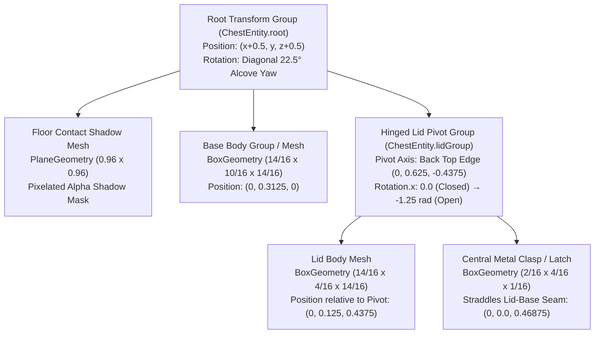

# 3D Model and Texture Specification: Articulated Minecraft Storage Chest

## Core Asset Overview
**Asset Name:** Articulated Minecraft Storage Chest  
**Engine Implementation:** Three.js + TypeScript (`src/game/chest.ts`, `src/game/blocks.ts`, `src/components/Game.tsx`)  
**Shading Model:** Matte Lambert / Standard Shader with Nearest-Neighbor Pixel Texture Sampling  
**Design Paradigm:** Multi-part jointed hierarchical assembly with real-time hinge articulation, pixelated contact shadows, and authentic Minecraft voxel aesthetic.

---

## I. Geometry and Model Structure (Articulation Architecture)

The chest is modeled not as a static monolithic cube, but as a **complex, multi-part articulated assembly** composed of distinct jointed groups:

### 1. Overall Size & Inset Proportions
- Standard Minecraft voxel blocks occupy a full $1.0 \times 1.0 \times 1.0$ unit envelope.
- To sit authentically **recessed** within the surrounding voxel grid:
  - **Width ($W$):** $\frac{14}{16} = 0.875$ units ($1$ pixel inset on left and right).
  - **Depth ($D$):** $\frac{14}{16} = 0.875$ units ($1$ pixel inset on front and back).
  - **Total Height ($H_{total}$):** $\frac{14}{16} = 0.875$ units ($2$ pixels clearance below ceiling).

### 2. Base Body Geometry
- **Dimensions:** $0.875 \times 0.625 \times 0.875$ units ($14/16 \times 10/16 \times 14/16$).
- **Local Position:** Centered at $(0, 0.3125, 0)$.
- **Structure:** Pixelated rectangular prism with corner edge banding outlining all vertical corner pillars and base rim.

### 3. Hinged Lid Group & Articulation Point
- **Dimensions:** $0.875 \times 0.250 \times 0.875$ units ($14/16 \times 4/16 \times 14/16$).
- **Articulation Axis (Hinge):** Located precisely along the back top edge of the base:
  $$\mathbf{P}_{\text{hinge}} = \left(0, 0.625, -0.4375\right)$$
- **Flush Resting State:** When $\theta = 0$, the lid rests flush on top of the base, spanning $Y \in [0.625, 0.875]$.
- **Open Articulation State:** Rotates backward smoothly up to $\theta_{\text{open}} \approx -71.6^\circ$ ($-1.25\text{ rad}$) on the X-axis:
  $$\theta(t) = \theta_{\text{current}} + (\theta_{\text{target}} - \theta_{\text{current}}) \cdot \min(1, 12 \cdot \Delta t)$$

### 4. Central Multi-Piece Latch Mechanism
- **Dimensions:** Width $0.125$ ($2/16$), Height $0.250$ ($4/16$), Depth $0.0625$ ($1/16$).
- **Positioning:** Mounted to the front face of the lid group at $(0, 0, D + 0.03125)$, protruding $1$ pixel forward.
- **Seam Alignment:** Straddles the boundary where the lid meets the base (spans $Y \in [0.50, 0.75]$ when closed).
- **Kinematic Hierarchy:** Attached as a child of the `lidGroup`, rotating seamlessly alongside the lid when the chest is opened.

### 5. Alcove Positioning & Diagonal Rotation
- **Placement:** Positioned within architectural alcoves in houses, village structures, and dungeons.
- **Diagonal Offset:** Rotated by $22.5^\circ$ ($\frac{\pi}{8} \approx 0.3927\text{ rad}$) to $30^\circ$ relative to the standard orthogonal voxel grid for depth and visual richness.

---

## II. Textures and Shaders (Pixel-Perfect Detail)

### 1. Color Palettes & Aesthetic Definitions

| Element | Hex Color Codes | Visual Role |
| :--- | :--- | :--- |
| **Wood Grain (Base & Lid)** | `#b88235`, `#c68c3a`, `#d19742`, `#dfa84f`, `#a46e25`, `#8f5c1a` | Warm golden-brown hand-painted timber grain with horizontal/vertical grain striations |
| **Metal Corner Banding** | `#1e1711` (outer dark), `#2e241c` (core), `#423529` (bevel highlight), `#5a4b3d` (rivet) | 2–3 pixel thick matte black/brown iron structural reinforcement with corner rivets |
| **Central Latch Mechanism** | `#a8a8a8` (silver body), `#dcdcdc` (core highlight), `#ffffff` (specular glint), `#4a4a4a` (rim), `#222222` (keyhole) | Multi-tier forged silver-gray latch with handle notch and lock slot |
| **Floor Shadow** | `rgba(0, 0, 0, 0.48)` (inner core), `rgba(0, 0, 0, 0.22)` (dithered edge), `rgba(0, 0, 0, 0.65)` (center) | 16x16 pixelated contact shadow quad directly underneath the base |

### 2. Texture Sampling & Material Settings
- **Filter Settings:**
  - `texture.magFilter = THREE.NearestFilter`
  - `texture.minFilter = THREE.NearestFilter`
  - `texture.generateMipmaps = false`
- **Material Definition:**
  - **Wood & Banding:** `MeshLambertMaterial` (or `MeshStandardMaterial` with `roughness: 0.95`, `metalness: 0.08`).
  - **Latch:** `MeshLambertMaterial` with `roughness: 0.40`, `metalness: 0.60`.
  - **Shadow:** `MeshBasicMaterial` with `transparent: true`, `opacity: 0.75`, `depthWrite: false`.

---

## III. File Map & Code References

- **Chest Module & Entity Factory:** [`src/game/chest.ts`](https://github.com/martintimmer/hollow-web-mc/blob/main/src/game/chest.ts)
  - `getOrCreateChestMaterials()`: Generates procedural 64x64 pixel-art texture canvas with golden wood grain, 2-3px metal corner banding, and silver latch.
  - `createArticulatedChest(options)`: Assembles root, shadow, base body, hinged lid, and front clasp.
  - `updateChestAnimation(chest, dt)`: Smooth lerp interpolation for opening/closing kinematics.
- **Block Definitions & Tile Coordinates:** [`src/game/blocks.ts`](https://github.com/martintimmer/hollow-web-mc/blob/main/src/game/blocks.ts)
  - Block ID `43`: `side: 55` (Chest Front with latch & seam), `top: 56`, `bottom: 56`.
- **Procedural Atlas & Chunk Rendering:** [`src/components/Game.tsx`](https://github.com/martintimmer/hollow-web-mc/blob/main/src/components/Game.tsx)
  - `pushChest(buf, x, y, z)`: Recessed static voxel chunk meshing with 1/16th margin.
  - `openChest(x, y, z)` / `closeChest()`: Real-time articulated 3D chest instance spawning and live hinge animation.
