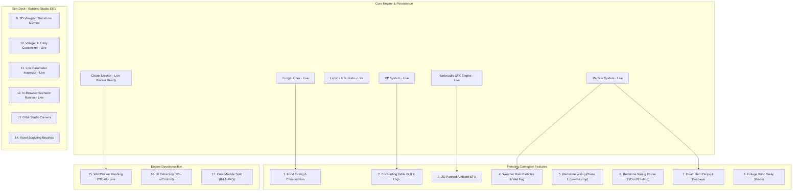

# Consolidated Implementation Plan: Technical Roadmap & Architecture Specs

This document provides a comprehensive technical roadmap, architecture specification, and execution history for all pending, implemented, and planned systems in **Hollowpine Web Minecraft**, consolidated from [`docs/GAMEPLAY_POLISH_SPEC.md`](https://github.com/martintimmer/hollow-web-mc/blob/main/docs/GAMEPLAY_POLISH_SPEC.md), [`docs/ROADMAP.md`](https://github.com/martintimmer/hollow-web-mc/blob/main/docs/ROADMAP.md), and [`docs/PROGRESS.md`](https://github.com/martintimmer/hollow-web-mc/blob/main/docs/PROGRESS.md).

---

## 🗺️ System Architecture & Dependency Map

---

## 📋 Task Breakdown & Technical Specifications

### 🍖 1. Food Eating & Consumption

- **Status:** Backlog (`GAMEPLAY_POLISH_SPEC.md` §4 / Backlog #2)
- **Dependencies:** Hunger & saturation engine (`s.player.hunger`, `s.player.saturation` — live).
- **Technical Specification:**
  - **Item Registry:** Assign `foodValue` and `saturationModifier` to food items in [`src/game/blocks.ts`](https://github.com/martintimmer/hollow-web-mc/blob/main/src/game/blocks.ts) (e.g., Cooked Beef: +8 hunger, +12.8 sat; Bread: +5 hunger, +6.0 sat; Apple: +4 hunger, +2.4 sat).
  - **Interaction:** Right-click (or hold `E` / mobile action) with edible item held when hunger $< 20$ (or unconditionally for golden apples).
  - **Animation & Timing:** 32-tick ($1.6\text{ s}$) consumption timer with rhythmic vertical item bobbing.
  - **Audio:** Procedural chewing sound bursts every 4 ticks; distinct swallowing gulp chime on completion via [`src/game/sfx.ts`](https://github.com/martintimmer/hollow-web-mc/blob/main/src/game/sfx.ts).
  - **Particles:** Spurt 3–6 food crumbs matching the item's texture atlas colors.

---

### ✨ 2. Enchanting Table GUI & Mechanics

- **Status:** Backlog (`ROADMAP.md` Phase 8 / `GAMEPLAY_POLISH_SPEC.md` #3)
- **Dependencies:** Experience points system (`src/game/xp.ts` — live with L30=1395 curve).
- **Technical Specification:**
  - **Interaction:** Right-click Enchanting Table (Block ID `44`/`116`) opens `<EnchantingModal />`.
  - **Bookshelf Detection:** Raycast/scan nearby $5 \times 5 \times 2$ perimeter for bookshelf blocks (max 15) to calculate max power level ($[1..30]$).
  - **UI & Costs:** 3 randomized enchantment offers displaying required player level ($L$), lapis lazuli cost ($1..3$), and XP level cost ($1..3$).
  - **Item Upgrades:** Attach enchant flags to armor/tools (`Protection`, `Sharpness`, `Efficiency`, `Unbreaking`, `Feather Falling`).

---

### 🔊 3. 3D-Positioned Ambient SFX

- **Status:** Backlog (`GAMEPLAY_POLISH_SPEC.md` §10 / Backlog #4)
- **Dependencies:** WebAudio engine (`src/game/sfx.ts`), Animal entities (`src/game/entities/animals.ts`).
- **Technical Specification:**
  - **Positional Audio:** Use WebAudio `StereoPannerNode` and distance gain attenuation:
    $$\text{pan} = \sin\left(\text{yaw}_{\text{player}} - \text{atan2}(\Delta z, \Delta x)\right), \quad \text{gain} = \max\left(0, 1 - \frac{d}{16}\right)$$
  - **Mob / Animal Calls:** Periodic calls (every 8–20s) panned dynamically for visible animals within 24m.
  - **Cave Ambience Detector:** Detect enclosed underground environments (when $\ge 60\%$ surrounding blocks within an 8-block sphere are solid) and crossfade a low-frequency drone loop ($0.3\text{ Hz}$ LFO filtered noise).

---

### 🌧️ 4. Weather Rain Particles & Wet Fog

- **Status:** Backlog (`GAMEPLAY_POLISH_SPEC.md` #5 / #17)
- **Dependencies:** Particle engine (`src/game/particles.ts`), weather state (`Game.tsx`).
- **Technical Specification:**
  - **Particle Simulation:** Dedicated instanced rain streak buffer ($200..400$ falling vertical streaks around player radius $16\text{m}$).
  - **Atmospheric Shading:** When weather transitions to `"rain"` or `"thunder"`, tighten fog near/far boundaries by $35\%$ and darken celestial ambient light.
  - **Audio:** Seamless procedural rain white-noise loop with soft lowpass filtering ($1.2\text{ kHz}$).

---

### ⚡ 5. Redstone Wiring (Phases 1 & 2)

- **Status:** Backlog (`GAMEPLAY_POLISH_SPEC.md` #6 / #15)
- **Dependencies:** Block edit pipeline (`edit()`, `setRaw()`), emitter lighting updates.
- **Technical Specification:**
  - **Phase 1 (Direct Activation):**
    - Interactive Levers (Block ID `107`) and Buttons toggle between on/off states on right-click.
    - Adjacent Redstone Lamps directly swap states: Unlit `104` $\longleftrightarrow$ Lit `83`.
    - Lit lamps register into the dynamic point-light emitter system.
  - **Phase 2 (Signal Propagation):**
    - Redstone Dust lines placeable on flat surfaces with 4-way visual cross/line connectivity.
    - Breadth-first search signal propagation up to 15 blocks with linear signal degradation ($\text{power} = \text{source} - \text{distance}$).

---

### 💀 6. Death Item Drops & 5-Minute Despawn

- **Status:** Backlog (`ROADMAP.md` Phase 8 / `GAMEPLAY_POLISH_SPEC.md` #7)
- **Dependencies:** Entity manager, Inventory (`src/game/inventory.ts`).
- **Technical Specification:**
  - **Spawning on Death:** When player health reaches $0$, iterate all occupied slots in `player_state.inventory` and spawn floating, slowly rotating 3D item entities with small outward velocities.
  - **Despawn Timer:** Track timestamp per item entity; remove after $300\text{ s}$ ($5\text{ minutes}$).
  - **XP Orb Dropping:** Drop XP orbs totaling $\min(100, 7 \times \text{level})$ at the death coordinates.

---

### 🌿 7. Foliage Wind Sway Shaders

- **Status:** Backlog (`GAMEPLAY_POLISH_SPEC.md` #11)
- **Dependencies:** Three.js chunk vertex shader (`src/game/engine/chunkMesh.ts`).
- **Technical Specification:**
  - Inject custom vertex shader displacement chunk on leaf (IDs `18`, `21`, `24`, `109`, `112`) and tall grass blocks.
  - Apply sinusoidal lateral offset:
    $$x_{\text{offset}} = \sin(t \cdot 1.8 + y \cdot 0.5 + x \cdot 0.2) \cdot 0.04$$
  - Exclude solid trunk/stone vertices via material vertex attribute flags to maintain zero chunk reconstruction overhead.

---

### 🚀 8. WebWorker Chunk Meshing Offload

- **Status:** ✅ Core Module Created (`src/game/engine/meshWorker.ts`)
- **Dependencies:** Geometry builders (`src/game/engine/chunkMesh.ts`).
- **Technical Specification:**
  - Dedicated zero-copy meshing module (`src/game/engine/meshWorker.ts`) with typed buffers (`Float32Array` / `Uint32Array`).
  - Transfer `ArrayBuffer` instances via zero-copy `postMessage(buffers, [buffers.pos.buffer, ...])`.

---

### 📦 9. UI Extraction (`R3`) & Codebase Refactoring (`R4`)

- **Status:** Backlog (`ROADMAP.md` Refactor Plan)
- **Dependencies:** `src/components/Game.tsx`.
- **Technical Specification:**
  - **Step R3 (UI Extraction):** Extract all inline GUI overlays from `Game.tsx` into standalone components in `src/ui/*` (`HUD.tsx`, `ChatModal.tsx`, `DeathScreen.tsx`, `TradeModal.tsx`, `CraftingModal.tsx`, `FurnaceModal.tsx`) using a typed `UIContext`.
  - **Step R4 (Core Module Split):** Extract residual closure logic into pure modules:
    - `src/game/meshing.ts`
    - `src/game/terrain.ts`
    - `src/game/villages.ts`
    - `src/game/liquid.ts`
    - `src/game/cartography.ts`
    - `src/game/engine.ts` (`EngineCore`)

---

## ⏱️ Execution Phases & Recommended Order

| Phase | System / Tasks | Status | Key Verification |
| :--- | :--- | :--- | :--- |
| **Phase 1: Survival Loops** | • Food eating & consumption mechanics • Death item drops & XP drop spill | ⏳ Next | Eat bread $\rightarrow$ hunger/saturation refills; die $\rightarrow$ items scatter & despawn after 5m. |
| **Phase 2: Progression & Depth** | • Enchanting table GUI & mechanics • 3D positional ambient audio (caves & animals) | ⏳ Backlog | Enchant tool at L30 with lapis; cave drone triggers underground. |
| **Phase 3: Atmosphere & Logic** | • Weather rain particles & wet fog • Redstone wiring Phase 1 (levers & lamps) | ⏳ Backlog | Rain drops with fog; lever toggles redstone lamp point light. |
| **Phase 4: Sim & Architecture** | • WebWorker chunk meshing module • Sim Deck 7-group catalog, parameters inspector, tests runner, scenes import/export • Port DEV & PROD chunk load & unpause isolation | ✅ Complete | `sim:test` 67/67 passing; 0-error build; :DEV direct boot, :PROD full chunk meshing. |
| **Phase 5: Studio Upgrade** | • Orbit studio camera • 3D transform gizmo • Blueprints & voxel brushes | ⏳ Planned | Free camera rotation around target; 2-click box selection blueprint stamp. |
