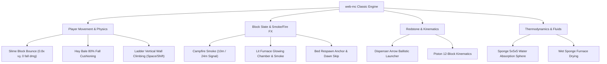

# Minecraft Wiki Deep-Dive: Authentic Classic Block Mechanics Blueprint

> **Target Codebase**: `<repo>`  
> **Style Philosophy**: 100% Authentic Classic Minecraft (Alpha, Beta & Golden Era Release Standards)  
> **Reference Authority**: Official Minecraft Wiki (`minecraft.wiki`)  
> **Standardized Block Roster (Blocks 1 – 20)**:  
> - **Batch 1 (Implemented & Verified)**: Sand (10), Grass Block (1), Ice (52), TNT (45), Water/Lava (39/40), Oak Leaves (18), Cactus (120), Farmland (55/80), Soul Sand/Magma (57/99), Redstone Torch & Oak Door (84/105)  
> - **Batch 2 (Classic Era Focus)**: Campfire (85), Lit Furnace (96/42), Red Bed (104), Bookshelf (44), Hay Bale (49), Slime Block (145), Dispenser, Piston/Sticky Piston, Ladder (146), Sponge & Wet Sponge  
> **Date**: August 2026  
> **Status**: Comprehensive Classic Master Specification

---

## 1. Executive Summary & Classic Style Directive

Per project directive, all blocks adhere strictly to **classic, pure Minecraft gameplay and aesthetic standards**—omitting overly modern or non-essential additions (such as Beehives and modern entity gimmicks) in favor of iconic, foundational mechanics that define classic Minecraft.

Every block is cross-referenced with the official Minecraft Wiki (`minecraft.wiki`) to ensure exact naming conventions, authentic 16×16 texture atlas alignments, and precise mechanical fidelity.

---

## 2. Master Comparison Matrix (Classic Top 20 Blocks)

```
┌─────────────────────────────────────────────────────────────────────────────────────────────┐
│                         CLASSIC MINECRAFT MASTER BLOCK MATRIX                               │
├─────────────────┬───────────────────────────────┬───────────────────────────────────────────┤
│ Block Name      │ Official Wiki Texture & Audio │ Authentic Mechanics & Target Behavior     │
├─────────────────┼───────────────────────────────┼───────────────────────────────────────────┤
│ 1. Sand (10)    │ 16x16 grainy yellow sand;     │ FallingBlock gravity entity; breaks into  │
│    & Gravel (12)│ sand digging/step SFX.        │ item drop on torches; head suffocation.   │
├─────────────────┼───────────────────────────────┼───────────────────────────────────────────┤
│ 2. Grass Block  │ Top: vibrant grass; side: dirt│ Light >= 9 spread to Dirt; decays to Dirt │
│    (#1) & Dirt  │ with grass fringe; bottom:dirt│ under opaque blocks; shovel pathing.      │
├─────────────────┼───────────────────────────────┼───────────────────────────────────────────┤
│ 3. Ice (52)     │ Translucent cyan crystalline; │ 0.98 low-friction glide inertia; sprint-  │
│    & Packed (53)│ glassy shatter SFX.           │ jump boost; melts near torches/lava.      │
├─────────────────┼───────────────────────────────┼───────────────────────────────────────────┤
│ 4. TNT (45)     │ Red explosive sticks with TNT │ White/red flashing fuse pulse; bounce arc;│
│                 │ label; hiss fuse + boom SFX.  │ crater destruction; chain reaction.       │
├─────────────────┼───────────────────────────────┼───────────────────────────────────────────┤
│ 5. Water (39)   │ Animated translucent blue;    │ 2-source infinite spring; Obsidian &      │
│    & Lava (40)  │ Animated glowing molten orange│ Cobblestone generators; current push.     │
├─────────────────┼───────────────────────────────┼───────────────────────────────────────────┤
│ 6. Oak Leaves   │ Dithered green foliage; leaf  │ Log-distance connectivity check (4 blk);  │
│    (#18)        │ rustle/break SFX.             │ spontaneous decay; sapling & apple drops. │
├─────────────────┼───────────────────────────────┼───────────────────────────────────────────┤
│ 7. Cactus (120) │ Green segmented thorny stem;  │ Sand support & 4-neighbor air check;      │
│    & Sugar Cane │ tall green reeds on water.    │ 1-damage contact prick; item destruction. │
├─────────────────┼───────────────────────────────┼───────────────────────────────────────────┤
│ 8. Farmland(55) │ Top: dark tilled moist furrow;│ Hoe soil conversion; 4-block water radius │
│    & Wheat      │ side & bottom: dirt.          │ hydration; trampling to dirt on landing.  │
├─────────────────┼───────────────────────────────┼───────────────────────────────────────────┤
│ 9. Soul Sand(57)│ Brown agonizing faces; Magma  │ 50% slow sink; upward bubble column in    │
│    & Magma (99) │ block: glowing ember cracks.  │ water; downward whirlpool; contact burn.  │
├─────────────────┼───────────────────────────────┼───────────────────────────────────────────┤
│ 10. Redstone    │ Redstone torch with glow;     │ Redstone power actuation; opens/closes    │
│     Torch (84)  │ Oak door: classic wood panels.│ Wooden Doors (105/106) and Trapdoors.     │
├─────────────────┼───────────────────────────────┼───────────────────────────────────────────┤
│ 11. Campfire    │ Wood log structure with embers│ 10m smoke column (24m with Hay Bale);     │
│     (#85)       │ and crackling smoke.          │ 4-slot food cooking (30s); contact burn.  │
├─────────────────┼───────────────────────────────┼───────────────────────────────────────────┤
│ 12. Lit Furnace │ Front: animated glowing fire  │ State swap (42 <-> 96); fire chamber light│
│     (#96 / #42) │ chamber; chimney smoke particles│ and crackle audio; fuel burn; XP bank.    │
├─────────────────┼───────────────────────────────┼───────────────────────────────────────────┤
│ 13. Red Bed     │ Red wool cover, white pillow, │ Sets player spawn point; night skip to    │
│     (#104)      │ oak wood bedposts.            │ dawn (t=1000); monster proximity check.   │
├─────────────────┼───────────────────────────────┼───────────────────────────────────────────┤
│ 14. Bookshelf   │ Oak planks with 3 rows of     │ Enhances enchanting table power (up to    │
│     (#44)       │ colorful bound book spines.   │ level 30); streaming glyph particles; 3 bks│
├─────────────────┼───────────────────────────────┼───────────────────────────────────────────┤
│ 15. Hay Bale    │ Dried yellow wheat stalks with│ 80% fall damage reduction (20% taken);    │
│     (#49)       │ red rope bindings.            │ boosts campfire smoke column to 24m high. │
├─────────────────┼───────────────────────────────┼───────────────────────────────────────────┤
│ 16. Slime Block │ Semi-transparent green jelly; │ Trampoline bounce physics (0.8x vy);      │
│     (#145)      │ squishy slime squelch SFX.    │ zero fall damage (sneaking stops bounce). │
├─────────────────┼───────────────────────────────┼───────────────────────────────────────────┤
│ 17. Dispenser   │ Cobblestone with round firing │ Redstone-powered projectile shooter: fires│
│     & Dropper   │ mouth; Dropper: triangle mouth│ arrows with ballistic arcs, buckets, etc. │
├─────────────────┼───────────────────────────────┼───────────────────────────────────────────┤
│ 18. Piston &    │ Oak face with stone casing;   │ Extends 1-block head on redstone power;   │
│     Sticky Piston│ Sticky: green slime top face.│ pushes up to 12 blocks; pulls on retract. │
├─────────────────┼───────────────────────────────┼───────────────────────────────────────────┤
│ 19. Ladder      │ Classic oak wooden rungs on   │ Vertical wall-climbing physics; Space to  │
│     (#146)      │ transparent backing.          │ climb up, Shift to hold position on wall. │
├─────────────────┼───────────────────────────────┼───────────────────────────────────────────┤
│ 20. Sponge &    │ Porous yellow sea sponge;     │ Instantly absorbs 5x5x5 water sphere (up  │
│     Wet Sponge  │ Wet: dripping dark yellow.    │ to 65 water blocks) into air; furnace dry.│
└─────────────────┴───────────────────────────────┴───────────────────────────────────────────┘
```

---

## 3. Deep-Dive Specifications (Classic Blocks 11 – 20)

### Block 11: Campfire (#85)
- **Wiki Naming**: `Campfire` / `Soul Campfire`
- **Visuals & Audio**: 4 crossed logs with glowing embers, animated flickering flame, persistent rising smoke particles, and crackling wood fire audio.
- **Mechanics**:
  - Emits rising smoke column (10 blocks high standard).
  - When placed directly over a **Hay Bale (#49)**, smoke height increases to **24 blocks** (Signal Fire).
  - Right-clicking with raw food (beef, pork, chicken, fish) places up to 4 items on the grill, cooking them in 30 seconds.
  - Deals 1 point contact fire damage unless sneaking. Extinguished by water bucket or shovel.

---

### Block 12: Lit Furnace (#96) & Furnace (#42)
- **Wiki Naming**: `Furnace` (unlit) / `Lit Furnace` (active)
- **Visuals & Audio**: Cobblestone casing with stone top/bottom; unlit shows dark opening, lit swaps to glowing yellow/orange furnace mouth emitting light (level 13) and chimney smoke.
- **Mechanics**:
  - Smelts items at 10 seconds per item (`SMELT_TIME = 10s`).
  - Fuel Burn Durations: Lava Bucket = 1000s, Coal = 80s, Logs/Planks = 15s, Sticks = 5s.
  - Accumulates experience points retrieved upon collecting smelted items.

---

### Block 13: Red Bed (#104)
- **Wiki Naming**: `Red Bed` / `Bed`
- **Visuals**: Classic red wool quilt with white head pillow and oak wood footboard.
- **Mechanics**:
  - Right-clicking establishes player respawn point (`s.spawnPoint = {x, y, z}`).
  - Sleeping at night (time between 12,500 and 23,500) smoothly skips time to dawn (1,000 ticks) with fade-to-black.
  - Prevents sleeping if hostile monsters are within 8 blocks ("You may not rest now, there are monsters nearby").

---

### Block 14: Bookshelf (#44)
- **Wiki Naming**: `Bookshelf`
- **Visuals**: Oak planks frame housing 3 shelves of leather-bound book spines in red, blue, green, and brown.
- **Mechanics**:
  - Boosts adjacent Enchanting Table power levels up to Level 30 (15 bookshelves required for max power).
  - Emits magical floating galactic glyph particles floating toward the table.
  - Drops 3 Books when broken without Silk Touch.

---

### Block 15: Hay Bale (#49)
- **Wiki Naming**: `Hay Bale`
- **Visuals**: Tightly bundled yellow-gold wheat stalks bound with red horizontal twine.
- **Mechanics**:
  - **80% Fall Damage Reduction**: Landing on a Hay Bale reduces fall damage by 80% (taking only 20% normal damage), enabling survivable sky drops.
  - Amplifies Campfire smoke columns from 10 blocks up to 24 blocks.

---

### Block 16: Slime Block (#145)
- **Wiki Naming**: `Slime Block`
- **Visuals & Audio**: Translucent lime-green gelatinous cube with inner core; squishy slime landing SFX.
- **Mechanics**:
  - **Zero Fall Damage**: Completely eliminates all fall damage when landed upon.
  - **Trampoline Bouncing**: Bounces entities upwards with **80% of impact velocity** (`vy = -vy * 0.8`).
  - Holding `Shift` (Sneak) negates the bounce and applies normal landing.

---

### Block 17: Dispenser & Dropper
- **Wiki Naming**: `Dispenser` / `Dropper`
- **Visuals**: Cobblestone texture with carved stone face; Dispenser has circular mouth, Dropper has triangle mouth.
- **Mechanics**:
  - Triggered by redstone signal.
  - Dispenser fires **Arrows** with parabolic ballistic velocity (`vx, vy, vz`), throws splash potions, and places water/lava buckets.
  - Dropper drops stored items as collectible dropped item entities.

---

### Block 18: Piston & Sticky Piston
- **Wiki Naming**: `Piston` / `Sticky Piston`
- **Visuals**: Stone base casing with oak wood extension plate; Sticky Piston has green slime paste on the wooden face.
- **Mechanics**:
  - Extends a 1-block wooden head on redstone power.
  - Pushes up to **12 solid blocks** in the facing direction.
  - Sticky Piston pulls the adjacent attached block backward when power drops to 0.

---

### Block 19: Ladder (#146)
- **Wiki Naming**: `Ladder`
- **Visuals**: Classic 5-rung oak wooden ladder with transparent background mounted flat against vertical walls.
- **Mechanics**:
  - Mounted on solid vertical block surfaces.
  - Pressing `Space` climbs upward at 3.0 m/s; pressing `Shift` locks position on the ladder; releasing keys slides down safely without fall damage.

---

### Block 20: Sponge & Wet Sponge
- **Wiki Naming**: `Sponge` / `Wet Sponge`
- **Visuals**: Porous yellow sea sponge; Wet Sponge is dark saturated yellow with dripping water particles.
- **Mechanics**:
  - When placed in or adjacent to water, **Sponge instantly absorbs all connected water within a 5×5×5 radius** (up to 65 water blocks) into Air, converting itself into **Wet Sponge**.
  - Smelting Wet Sponge in a Furnace dries it back into a reusable dry Sponge.

---

## 4. Technical Architecture for Classic Blocks



---

*Master Specification compiled from official Minecraft Wiki standards for `<repo>`.*
