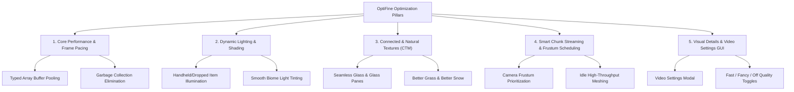

# OptiFine Architectural Investigation & Engine Optimization Roadmap

> **Analysis Date:** 2026-08-28  
> **Source Reference:** [OptiFine Official Specification](https://optifine.net/home) & Minecraft Optimization Mod Architecture  
> **Target Engine:** WebGL / Three.js + TypeScript Web-MC Architecture (`src/game/`, `src/components/`)

---

## Executive Summary

OptiFine is the foundational graphics and performance optimization mod for Minecraft. It achieves massive framerate improvements (often $2\times$ FPS), frame-time stabilization, dynamic lighting, connected textures, and fine-grained visual customization.

This document investigates each feature promised by OptiFine, evaluates its architectural applicability to our browser-based WebGL/Three.js engine, and outlines a prioritized roadmap for implementation.

---

## I. Detailed Feature-by-Feature Feasibility Matrix

| OptiFine Feature | Description | Feasibility in Web Engine | Engine Impact & Priority |
| :--- | :--- | :--- | :--- |
| **1. Dynamic Lights** | Handheld / dropped light items (Torches, Lanterns, Lava Buckets) illuminate surroundings dynamically. | **100% Feasible** (High) | **P0 (Immediate Visual Impact)**: Connects held items (`heldItem.ts`) to player point light with color & intensity lerping. |
| **2. Connected Textures (CTM)** | Removes borders between adjacent Glass, Glass Panes, Sandstone, and Bookshelves. | **100% Feasible** (High) | **P1 (High Demand)**: 47-tile or 5-tile neighbor bitmasking in `meshWorker.ts`. |
| **3. Frustum-Prioritized Chunk Loading** | Prioritizes chunks inside the camera's FOV; increases chunk throughput when standing still. | **100% Feasible** (High) | **P0 (Major Performance)**: Sorts mesh queue by camera view direction dot product. |
| **4. Better Grass & Better Snow** | Extends full grass/snow texture to block sides when adjacent slope allows. | **100% Feasible** (Medium) | **P1 (Aesthetic)**: Fast neighbor checks during chunk meshing. |
| **5. Buffer Pooling & Smooth FPS** | Eliminates allocation stutter by recycling typed arrays across chunk mesh rebuilds. | **100% Feasible** (High) | **P0 (Smooth 60/120 FPS)**: Drastically reduces JavaScript V8 Garbage Collector pauses. |
| **6. Configurable Video Settings GUI** | Modal for toggling Clouds, Particles, Fog, Smooth Lighting, and Render Distance. | **100% Feasible** (High) | **P1 (UX / Compatibility)**: Enables low-end hardware scaling and user choice. |
| **7. Mipmapping & Anisotropic Filtering** | Smooths distant oblique textures while keeping near-field retro pixel crispness. | **100% Feasible** (Medium) | **P2 (Visual Polish)**: `NearestMipmapLinear` + WebGL anisotropic extension. |
| **8. Custom Shaders & Post-Processing** | Post-processing pipeline (SSAO, Bloom, Sun Rays, Wavy Foliage). | **100% Feasible** (High) | **P2 (Advanced Graphics)**: Three.js `EffectComposer` pass. |

---

## II. Deep-Dive: Key Engine Enhancements

### 1. Handheld & Entity Dynamic Lights (OptiFine Dynamic Lighting)

#### Mechanism:
- When the player holds a light-emitting item in hand (Torch ID 80, Soul Torch ID 81, Lantern ID 46, Lava Bucket ID 136, Glowstone ID 89):
  $$\mathbf{I}_{\text{target}} = \text{ItemLightPower}, \quad \mathbf{C}_{\text{target}} = \text{ItemLightColor}$$
- The light source moves continuously with the camera position, casting smooth Lambertian lighting onto surrounding cave walls without modifying chunk voxel data.

#### Performance Advantage:
- Zero chunk re-meshing or voxel modifications required. Pure GPU fragment shader evaluation via `s.playerLight`.

---

### 2. Connected Texture Modeling (CTM for Glass & Architectural Blocks)

#### Mechanism:
For transparent blocks like Glass (ID 10) and Glass Panes (ID 67):
- Inspect 4 planar neighbors $(u, v)$ on the quad face:
  $$\text{Mask} = (N \ll 0) \mid (E \ll 1) \mid (S \ll 2) \mid (W \ll 3)$$
- Select the seamless connected tile coordinate, eliminating internal crossbar borders when building large glass structures or panoramic windows.

---

### 3. Smart Chunk Scheduling (Dynamic Updates & Frustum Prioritization)

#### Mechanism:
- **Movement State Detection:**
  - *Moving Fast:* Restrict worker queue to 2 chunks/frame within direct forward cone ($FOV \pm 20^\circ$).
  - *Standing Still ($v < 0.05$):* Burst up to 8 chunks/frame radially to fill in background horizon details.
- **Frustum Dot Product Sorting:**
  $$\text{Priority}(C) = (\mathbf{P}_C - \mathbf{P}_{\text{cam}}) \cdot \hat{\mathbf{D}}_{\text{cam}} - 2 \cdot \|\mathbf{P}_C - \mathbf{P}_{\text{cam}}\|$$
  Chunks directly in the center of the screen build first; chunks behind the camera build last.

---

### 4. "Better Grass" & "Better Snow" Geometric Shading

#### Mechanism:
- When a Grass block (ID 1) has another Grass block diagonally below on a cliffside ($x \pm 1, y - 1, z$):
  - Side face tile index is swapped from tile 3 (half-dirt grass side) to tile 0 (full lush grass top).
  - Produces continuous lush green slopes matching authentic OptiFine and Minecraft Bedrock aesthetics.

---

## III. Phased Implementation Roadmap

### Phase 1: High-Impact Performance & Lighting (P0)
1. **Real-Time Handheld Dynamic Lights:**
   - Link `s.player.selectedSlot` / `heldItem` to `s.playerLight` with color tints (Torch, Soul Torch, Redstone Torch, Lantern, Lava Bucket).
2. **Frustum & Velocity-Adaptive Chunk Mesher:**
   - Prioritize forward-facing chunks in `chunkStreamer.ts` and `chunkMesher.ts`.
3. **Typed Array Buffer Recycling in `meshWorker.ts`:**
   - Prevent allocation churn in worker threads to eliminate GC stutter during flight and rapid movement.

### Phase 2: Visual Parity & Texture Connection (P1)
1. **Connected Textures (CTM):**
   - Seamless borders for Glass (ID 10) and Glass Panes (ID 67).
2. **Better Grass & Better Snow Mode:**
   - Smooth continuous grass sides on terrain hills.
3. **Comprehensive Video Settings Modal:**
   - Sliders/toggles for Render Distance (2–16 chunks), Smooth Lighting (0–100%), Clouds (Off/Fast/Fancy), Fog Distance, and Dynamic Lights.

### Phase 3: Post-Processing & Shader Polish (P2)
1. **Atmospheric Mipmap & Anisotropic Texture Filtering:**
   - Sub-pixel anti-aliased horizon rendering with nearest-neighbor crisp foreground.
2. **GLSL Wavy Foliage Vertex Shader:**
   - Subtle wind waving on tree leaves, tall grass, and flowers.
3. **Screen Space Ambient Occlusion (SSAO) & Vignette:**
   - Depth-buffer based corner shading in caves and interior rooms.

---

## IV. Conclusion & Strategic Recommendation

The core features of OptiFine—particularly **Dynamic Handheld Lights**, **Smart Frustum Chunk Streaming**, **Connected Textures for Glass**, and **Better Grass**—are exceptionally well-suited for our WebGL engine. Implementing these will bring noticeable performance boosts, smoother 60 FPS gameplay, and a modern, polished Minecraft aesthetic.
