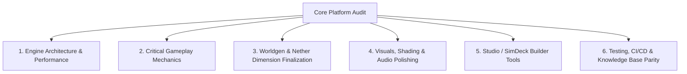
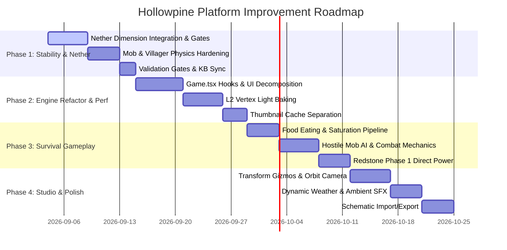

# Hollowpine Web Minecraft — Platform Improvement Plan (2026+)

> **Document Version**: 1.0.0  
> **Target Platform**: Hollowpine Web Minecraft (`<repo>`)  
> **Engine**: React 19 + Three.js (WebGL2/WebGPU-ready) + Vite + Express / SQLite (`sql.js`)

---

## 1. Executive Summary & Diagnostic Assessment

Hollowpine is an ambitious, high-performance in-browser voxel engine featuring infinite procedural chunk streaming, procedural textures and WebAudio sound synthesis, entity spawning, custom building studio tools, and dual-port deployment (Prod `:PROD` / Dev Sim `:DEV`).

Following an in-depth audit of the repository, architecture documents, the uncommitted working-tree state, and open backlog items, this document outlines **the most critical improvements, high-impact new features, and technical debt remediations** required to elevate the platform to industry-leading web-game standards.



---

## 2. Most Critical Items Needing Immediate Improvement

### 2.1. Complete the Nether Dimension Integration & Gate Verification
* **Current State**: `netherGenerator.ts`, `netherGate.ts`, `dimensionManager.ts`, and `PortalModal.tsx` exist as untracked files or partial implementations in the working directory.
* **Problems**:
  - Uncommitted dimensional state can lead to regressions or drift between branches.
  - Coordinate scaling (8:1 Overworld $\leftrightarrow$ Nether) and reciprocal portal searching require rigorous automated gating.
  - Atmosphere switching (crimson fog, hiding celestial skyboxes, disabling beds with explosion reactions) needs complete hookup in the render loop.
* **Plan**:
  1. Audit and stage untracked Nether files (`src/game/terrain/netherGenerator.ts`, `netherGate.ts`, `dimensionManager.ts`, `portalStorage.ts`).
  2. Implement bidirectional portal matching cache with chunk pre-warming.
  3. Validate against `scripts/test-nether-gate.mjs` and `scripts/test-nether-generator.mjs`.

### 2.2. Decompose `src/components/Game.tsx` (Down from 5,000+ Lines)
* **Current State**: Although an initial modularization reduced `Game.tsx` from 9,308 lines to ~5,045 lines, `Game.tsx` still handles excessive orchestration, user input state, modal management, HUD snapshots, and direct entity updates.
* **Plan**:
  - **Extract Custom Hooks**:
    - `usePlayerInput`: Handles pointer lock, touch controls, keyboard bindings (`W/A/S/D`, flight, hotbar keys).
    - `useGameModals`: Handles state transitions for Inventory, Crafting Table, Chest, Furnace, Villager Trade, Portal, and Settings.
    - `useWorldPersistence`: Handles auto-saving, chunk serialization, and network sync.
  - **Target**: Reduce `Game.tsx` to $< 1,000$ lines of clean, declarative React orchestration.

### 2.3. Resolve Mob & Villager Pathfinding & Collision Clipping
* **Current State**: As identified in [`docs/KNOWN_ISSUES.md`](https://github.com/martintimmer/hollow-web-mc/blob/main/docs/KNOWN_ISSUES.md), villagers can become trapped in stairs/doors, sink 1 block into terrain upon chunk load, or trade through solid walls. Animals lack cohesive herd behaviors and cliff-edge safety.
* **Plan**:
  - Formalize an AABB voxel physics collision box for all entities (mirroring `playerPhysics.ts`).
  - Introduce raycast line-of-sight (`raycastLOS`) check before triggering villager trades or mob aggro.
  - Implement a universal step-up algorithm ($0.5\text{m}$ step height for slabs and stairs) to stop mobs from sinking or sticking.

### 2.4. Finish L2 Lighting Baking (Vertex Light vs Point Light Pool)
* **Current State**: Currently uses a pool of dynamic Three.js point lights for torches and lanterns. This strains mobile GPUs (causing draw call overhead and light-cap limitations).
* **Plan**:
  - Implement a 4-bit Sky Light + 4-bit Block Light propagation model (flood-fill algorithm in `meshWorker.ts`).
  - Bake static light values directly into vertex colors during chunk meshing.
  - Reduce real-time dynamic point lights to 1 (for hand-held light sources only), increasing rendering performance by 2–4× on lower-end devices and mobile browsers.

---

## 3. High-Priority New Features & Functionality Ideas

### 3.1. Full Survival Gameplay Loop (Food, Hunger & Combat)
1. **Food Eating & Saturation Mechanic**:
   - Holding right-click with an edible item initiates a 1.6s eating animation with WebAudio chewing sounds and crumb particle bursts.
   - Restores food points (`hunger`) and saturation points based on Minecraft wiki specs.
2. **Dynamic Hostile Mob AI & Combat Mechanics**:
   - Zombie: Direct pathing toward player with melee contact damage.
   - Skeleton: Ranged pathing, maintaining 8–14 block distance while shooting procedural arrows (`src/game/engine/arrows.ts`).
   - Creeper: Proximity sizzle sound countdown ($1.5\text{s}$), flashing white, triggering `createExplosion()`.
   - Player knockback, invulnerability frames ($0.5\text{s}$ damage tick), and flashing red hit-overlay.

### 3.2. Redstone Logic Engine (Phase 1 & Phase 2)
1. **Input Triggers & Direct Activation**:
   - Levers, stone/wood buttons, and pressure plates.
   - Direct powering of adjacent Redstone Lamps (Block `104` unlit $\leftrightarrow$ `83` lit) and iron/wooden doors.
2. **Dust Signal Propagation**:
   - Breadth-first search signal propagation up to 15 blocks with power level degradation ($P = 15 - \text{dist}$).
   - Dynamic 4-way visual cross and line connection meshing.

### 3.3. Enhanced Builder Studio ("SimDeck" 2.0 on Port DEV)
1. **In-Scene Transform Gizmos (Roadmap B2)**:
   - Three-axis translation and rotation handles directly overlaid in the 3D viewport for placed objects and structures.
2. **Voxel Sculpting Brushes (Roadmap B4)**:
   - Sphere, cuboid, cylinder, and smooth/flatten terrain brushes with radius $1\text{m} - 8\text{m}$.
3. **Schematic & Litematica Import/Export (Roadmap B9)**:
   - Web-based upload and parsing of standard `.schem` and `.litematic` files into placed in-game voxels.
4. **Blender-Style Orbit Camera (Roadmap B1)**:
   - `Alt + Left Click` to orbit, `Middle Mouse` to pan, scroll wheel to zoom without locking the cursor.

### 3.4. Dynamic Weather & Atmospheric Audio
1. **Rain & Snow Simulation**:
   - Instanced particle buffers rendering falling precipitation within a 16-block radius of the player.
   - Biome-dependent: Rain in Plains/Forests, Snow in Snowy Peaks/Taigas, none in Deserts/Nether.
2. **3D Positional & Cave Ambience SFX**:
   - Enclosed space detection (when $\ge 60\%$ of surrounding blocks within 8m are solid) triggers synthesized low-frequency drone ambient audio.
   - Positional stereo-panned sound for mob cries and running water.

---

## 4. Technical Debt & Codebase Quality

| Component | Issue | Proposed Remediation | Priority |
| :--- | :--- | :--- | :--- |
| **`catalog/completeRegistry.json`** | Hardcoded block IDs prone to collisions | Maintain `catalog/patchRegistryIds.mjs` as strict automated CI gate; reject manual edits to `blocks.ts`. | High |
| **Thumbnail Assets** | Base64 strings bloated inside main bundle | Separate `/catalog/thumbnails.json` into lazy-loaded ObjectURLs or indexed DB cache to drop bundle size by ~2.5 MB. | High |
| **Worker Mesher Parity** | Divergence risk between `meshWorker.ts` and `chunkMesher.ts` | Shared schema test harness validating identical geometry outputs for all 120+ block types. | High |
| **Untracked Working Directory Files** | Uncommitted Nether files, KB entries, test scripts | Review, run verification gates, and commit clean milestones. | Critical |

---

## 5. Phased Implementation Roadmap



### Phase 1: Immediate Stabilization & Dimensional Completion
- Verify and finalize Nether dimension generation, portal mechanics, and dual-world persistence.
- Fix entity collision and villager ground alignment.
- Run machine gates (`tsc -b`, `npm run build`, `npm run sim:test`, `npm run kb:check`, `npm run pages:check`).

### Phase 2: Engine Performance & Code Decoupling
- Break down `Game.tsx` into modular React hooks.
- Implement vertex light baking to relieve GPU point light constraints.
- Lazy-load thumbnail dictionaries to reduce bundle footprint.

### Phase 3: Survival Depth & Mechanics
- Complete food consumption and hunger degradation.
- Implement hostile mob attack cycles and player health/combat feedback.
- Introduce direct redstone activation (levers, buttons, redstone lamps).

### Phase 4: Builder Studio & World Polish
- Add 3D transform gizmos, orbit controls, and voxel brushes to SimDeck on `:DEV`.
- Integrate weather precipitation and 3D positional ambient audio.
- Enable `.schem` schematic loading.

---

## 6. Verification & Quality Gates

Every implementation step must satisfy the repository's strict verification gates:
1. **Typecheck & Bundling**:
   ```bash
   npx tsc -b
   npm run build
   ```
2. **Simulation & Logic Tests**:
   ```bash
   npm run sim:test
   node catalog/textureCheck.mjs
   node scripts/test-worker-meshing.mjs
   ```
3. **Documentation & Knowledge Base Integrity**:
   ```bash
   npm run kb:check
   npm run pages:check
   ```
